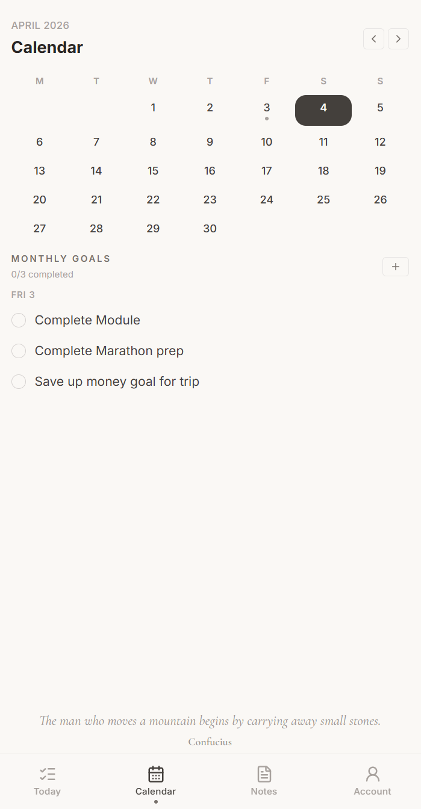
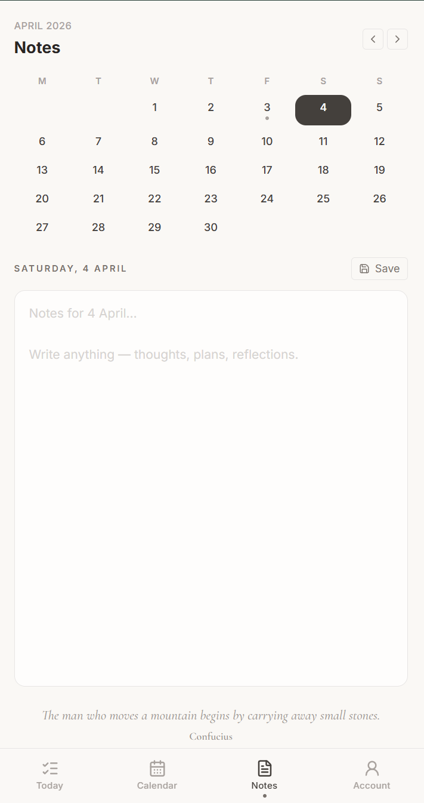

# Taskly — Daily Journal Planner

> A mobile-first daily planner web app with a notebook aesthetic — combining task management, gratitude journaling, affirmations, and reflections in a warm, minimal interface.


**[Live Demo →](https://taskly-daily-journal-planner.vercel.app/)**

---

## Screenshots

| Today | Calendar | Notes |
|---|---|---|
|  |  |  |

---

## Overview

Taskly is a frontend-only progressive web app — no backend, no account required. All data persists in localStorage. It's designed to feel like opening a physical journal: ruled lines, warm paper tones, and smooth animations. Three pages cover daily planning, a calendar view, and freeform date-based notes. - Really Exciting project that is being worked on with big influence from **GITHUB COPILOT.**

---

## Features

- **Daily planner** — task list on notebook-ruled lines with priority ranks A1–C3 and auto-sort
- **Gratitude journaling** — three daily gratitude prompts, affirmation input, and end-of-day reflection
- **Calendar view** — monthly grid with dot indicators on dates that have tasks; tap any date to view
- **Date-based notes** — freeform notes per date with auto-save and dot indicators on the calendar
- **Smooth animations** — task add/remove/reorder via `@formkit/auto-animate`; strikethrough animation on task complete
- **PWA ready** — installable on mobile with `manifest.json`, standalone display mode, and custom favicon
- **Daily quotes** — 365 real attributed quotes rotated by epoch day, no server call required
- **Google sign-in** — optional account with cloud sync via Firebase; works fully offline without an account

---

## Account & Cloud Sync

Taskly works entirely offline without an account — but signing in unlocks cloud sync across devices.

**Authentication**
- Sign in with Google via Firebase Authentication (one tap)
- Popup-based auth with redirect fallback for broader browser compatibility
- Bottom nav displays your Google profile photo when signed in, or a default icon when signed out

**Cloud Sync (Firebase Firestore)**
- Tasks, notes, and journal entries sync to Firestore in real time when signed in
- Data is stored per-user under a unique account, enabling cross-device access
- On first sign-in, local data is automatically migrated to the cloud — only if the cloud is empty, preventing any overwrites
- Real-time listeners keep data in sync across tabs and devices

---

## Tech Stack

| Package | Version | Purpose |
|---|---|---|
| React | 19.2.4 | UI framework |
| TypeScript | 5.9.3 | Type safety across components and hooks |
| Vite | 8.0.1 | Build tool and dev server with HMR |
| Tailwind CSS | 3.4.19 | Utility-first styling, custom cream palette |
| Firebase | — | Google Authentication + Firestore cloud sync |
| date-fns | 4.1.0 | Date formatting, comparison, calendar utilities |
| @formkit/auto-animate | 0.9.0 | Zero-config list animations |
| Vitest | 4.1 | Unit + component testing framework |
| Testing Library | — | React component rendering + DOM assertions |
| PostCSS + Autoprefixer | — | CSS processing pipeline |

---

## Getting Started

**Prerequisites:** Node.js 18+
```bash
# 1. Clone the repo
git clone https://github.com/TobiOparinde/Taskly---Daily-Journal-Planner.git
cd Taskly---Daily-Journal-Planner

# 2. Install dependencies
npm install

# 3. Start the dev server
npm run dev
```

---

## Scripts

| Command | Description |
|---|---|
| `npm run dev` | Start Vite dev server with HMR |
| `npm run build` | Type-check (`tsc -b`) then production build |
| `npm run preview` | Preview production build locally |
| `npm run lint` | Run ESLint with TypeScript + React Hooks plugins |
| `npm test` | Run the full Vitest test suite (31 tests) |
| `npm run test:watch` | Run tests in watch mode with auto-rerun on save |

---

## Project Structure
```
src/
├── App.tsx              — Root layout, routing, state orchestration
├── TodayPage.tsx        — Daily planner — tasks, gratitude, affirmations
├── CalendarPage.tsx     — Calendar date picker + task list
├── CalendarGrid.tsx     — Shared calendar grid component
├── NotesPage.tsx        — Date-based freeform notes editor
├── TaskCard.tsx         — Individual task row component
├── TaskModal.tsx        — Bottom-sheet modal for add/edit task
├── RankColumn.tsx       — A1–C3 priority rank selector
├── BottomNav.tsx        — Three-tab navigation bar
├── QuoteFooter.tsx      — Daily rotating inspirational quote
├── quotes.ts            — 365 curated daily quotes
├── types.ts             — TypeScript interfaces (Task, Note, Rank)
├── useTasks.ts          — Task state management hook
├── useNotes.ts          — Notes state management hook
├── storage.ts           — localStorage persistence layer
├── dateUtils.ts         — Date helper utilities
├── ErrorBoundary.tsx    — React error boundary to prevent blank-screen crashes
├── app.test.tsx         — Vitest test suite (31 tests across 7 groups)
├── test-setup.ts        — Test environment setup (jest-dom matchers)
├── index.css            — Global styles + Tailwind directives
└── main.tsx             — App entry point
```

---

## Testing

Taskly includes a comprehensive test suite built with **Vitest** and **React Testing Library**, covering the core logic that handles task data throughout its lifecycle. Run with `npm test`.

**31 tests across 7 groups:**

| Group | Tests | What it covers |
|---|---|---|
| **Storage** | 4 | localStorage round-trip persistence, corrupted JSON recovery, unique ID generation |
| **Firestore safety (`clean()`)** | 3 | Stripping `undefined` values before Firestore writes, verifying ranked tasks (A1–C3) survive serialisation |
| **Task sorting** | 6 | Completed tasks sink to bottom, all 9 priority ranks sort A1→C3, A1 completed reorder, malformed/null rank values handled gracefully |
| **Source filtering** | 4 | Calendar/monthly-goal tasks excluded from daily view, mixed-source filtering, date-scoped filtering |
| **TaskCard rendering** | 7 | Every valid rank renders correctly, no-rank tasks render safely, completed styling applied, toggle callback fires, null/malformed rank doesn't crash, description displayed |
| **Toggle round-trip** | 3 | Toggling A1 preserves the task in storage, toggling back and forth preserves all fields (rank, description, date) |
| **Edge cases** | 4 | Empty list, single task, 100-task stress test, all optional fields undefined |

**Key regression tests** — the suite specifically guards against a production bug where completing an A1-ranked task caused a blank screen and data loss:
- Verifies A1 tasks persist after toggle (not silently dropped)
- Verifies sort logic handles the A1→bottom reorder without throwing
- Verifies `clean()` doesn't strip valid rank data before Firestore sync
- Verifies TaskCard renders A1 badge without crashing on malformed data

**Stack:** Vitest 4.1 · React Testing Library · jsdom · jest-dom matchers

---

## Design Decisions

**Notebook aesthetic** — ruled lines are CSS repeating linear gradients with `backgroundAttachment: 'local'` so they scroll with content, not the viewport.

**Shared CalendarGrid** — extracted into a single component used by both Calendar and Notes pages, guaranteeing pixel-identical calendars with no duplication.

**Priority ranking** — an A/B/C × 1/2/3 grid gives 9 ranks and finer control than simple high/medium/low. Tasks auto-sort A1 → C3, with unranked tasks last.

**No backend** — localStorage keeps the app fully self-contained and instantly deployable. A thin `storage.ts` wrapper handles JSON serialisation with `try/catch` throughout.

**Mobile-first** — max-width 480px, `height: 100dvh`, safe-area-inset padding for iPhone notch, `autoFocus` removed on modals for iOS keyboard compatibility.

**Daily quotes** — 365 real attributed quotes rotated by epoch day modulo, so the quote changes at midnight without any server call.

---

*Built using React + TypeScript + Vite* - Practicing using Github Copilot in Vscode + CLI